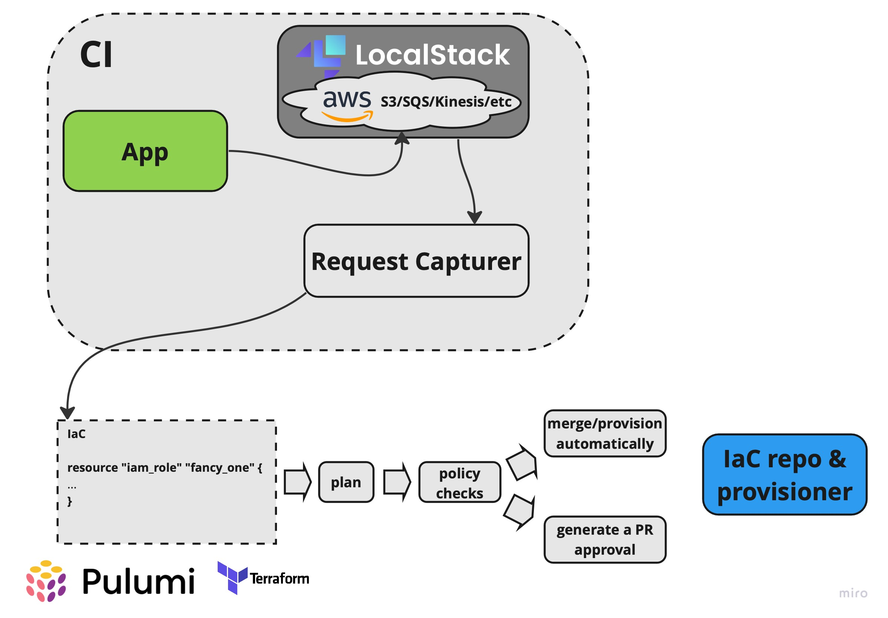

# Localstack AWS requests Capturer
Utility sniffs AWS requests coming to [Localstack](https://docs.localstack.cloud/ci/) captures them and generates composable snippets of IaC on nthe fly off of it, like:
- IAM policies and roles to grant permission for those requests
- Terraform plan
- Pulumi stack configurations
- etc

*Right now it's being designed to be used as auxiliary container in [CI flow](https://docs.localstack.cloud/ci/)*

## Overview


## Description
Regural workflow for generic application working with AWS entities requires setting up permissions for accessing those typically described with IaC provisders like Terraform/Pulumi/etc. 
Before application is able to be deployed into any environment there should be those resources already provisioned. 
Current utility is aiming to simplify the process of onboarding to CI/CD and make it smoother.
[LocalStack](https://localstack.cloud) provides a way to mock AWS traffic but it only provides analytics in an Enterprise plan.
Current utility parses LocalStack's output, aggregates request types and generates composable outcomes off of it.

## Demo usage (for macOS)

```
make bootstrap
sleep 30
make log
```

it make take longer to pull images, so in order to re-run execute:
```
make redeploy
make log
```
## Example
After **Demo app** runs next queries 
```
aws --endpoint-url=http://localstack:4566 s3 ls
aws --endpoint-url=http://localstack:4566 sqs list-queues
aws --endpoint-url=http://localstack:4566 kinesis list-streams
aws --endpoint-url=http://localstack:4566 lambda list-functions
```

**Request Capturer** utility will generate next output
```
====== Policy ===============
{
    "Statement": {
        "Action": [
            "s3:ListBuckets",
            "sqs:ListQueues",
            "kinesis:ListStreams",
            "lambda:ListFunctions"
        ],
        "Effect": "Allow",
        "Resource": "*",
        "Sid": "RANDOM"
    },
    "Varsion": ""
}
====== ============== =======

====== Terraform plan =======
    resource "aws_iam_policy" "s3-policy" {
    name        = "S3 IAM policy"
    path        = "/"
    description = "IAM policy generated on top of results provided by sniffer"
    policy      = "
{"Statement": 
    {
        "Action": 
            [
                "s3:ListBuckets",
                "sqs:ListQueues",
                "kinesis:ListStreams",
                "lambda:ListFunctions"
            ],
        "Effect": "Allow",
        "Resource": "*",
        "Sid": "RANDOM"
    },
 "Version": ""
}
====== ============== =======
```

This can be passed over directly to Terraform/Pulumi/etc or pushed to a IaC repo as a PR 

## Repo content description 
- ./ - simple capturer utility writteng in [Go](https://go.dev/doc/)
- ./demo-app/ - simple demo script generating [AWS request traffic](https://docs.localstack.cloud/integrations/aws-cli/)
- ./build/ - build scripts
- ./deploy/ - demo Kubernetes deployment for everything
- ./deploy/kind-registry.sh - [kind](https://kind.sigs.k8s.io) is beings used as a local Kubernetes emulation harness ()
- ./deploy/install-localstack.sh - Localstack is being instaleld with [Helm chart](https://docs.localstack.cloud/get-started/#deploy-localstack-using-helm)

just change the list of requests in *./build/local.sh* 
rebuild with 
```
make rebuild-demo
```
and see how output changes with 
```
make log
```

## Some comments on Capturer logic
- App reads localstack's logs thru Kubernetes logs bus(can be switched to more native integration)
- Parsing is being done using primitive regexps, can get more fancy if required
- Hashicorp's [hcl](https://github.com/hashicorp/hcl) lib used to marshal Go structs into HCL

## Further ideas
- Terraform output can be checked by Hashicorp Sentinel or tflint/etc
- Utility can be packaged into Kubernetes operator, so it can accept more sophisticated configuration in in format of CRD
- More integrations beyond Terraform and Pulumi can be added
- Apply [Kind GitHub Action](https://github.com/marketplace/actions/kind-cluster) to run some testing